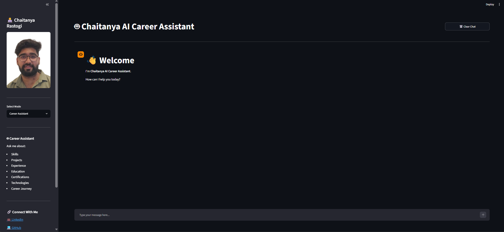
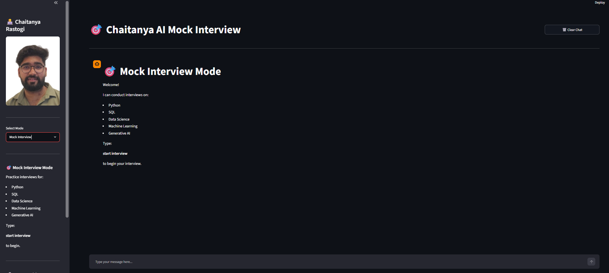

# 🤖 Chaitanya AI Career Assistant

An AI-powered Career Assistant built using Retrieval-Augmented Generation (RAG), LangChain, FAISS, Google Gemini, and Streamlit.

This project acts as an interactive version of my portfolio and resume, allowing recruiters, hiring managers, and interviewers to learn about my skills, projects, certifications, and experience through natural conversations.

---

## 📌 Features

### 🤖 AI Career Assistant

* Answers questions about my:

  * Skills
  * Projects
  * Experience
  * Education
  * Certifications
  * Technologies

* Resume-based Retrieval-Augmented Generation (RAG)

* Context-aware responses

* Recruiter-friendly AI portfolio

* Interactive conversational experience

### 🎯 Mock Interview Mode

Practice interviews for:

* Python
* SQL
* Data Science
* Machine Learning
* Generative AI

Features:

* Technical interview questions
* Follow-up questions
* Answer evaluation
* Interactive interview experience

---

## 🛠️ Tech Stack

### Frontend

* Streamlit

### LLM

* Google Gemini 2.5 Flash

### RAG Components

* LangChain
* FAISS Vector Database
* HuggingFace Embeddings

### Machine Learning & AI

* Python
* Sentence Transformers
* Retrieval-Augmented Generation (RAG)

### Version Control

* Git
* GitHub

---

## 📂 Project Structure

```text
Chaitanya_AI_Career_Assistant/
│
├── app.py
├── ingest.py
├── requirements.txt
├── .env
├── README.md
│
├── assets/
│   ├── profile.jpg
│   └── resume.pdf
│
├── knowledge/
│   ├── skills.md
│   ├── projects.md
│   ├── certifications.md
│   └── resume.pdf
│
├── vectorstore/
│   ├── index.faiss
│   └── index.pkl
│
└── src/
    ├── chat_engine.py
    ├── document_loader.py
    ├── chunking.py
    └── vectorstore_builder.py
```

---

## 🧠 How It Works

### Step 1: Knowledge Base

The chatbot reads information from:

* about_me.md
* skills.md
* projects.md
* certifications.md
* experience.md

### Step 2: Vector Embeddings

Documents are converted into embeddings using:

```python
sentence-transformers/all-MiniLM-L6-v2
```

and stored inside FAISS.

### Step 3: Retrieval

Relevant information is retrieved based on the user's question.

### Step 4: Response Generation

Google Gemini generates responses using the retrieved context.

---

## 📸 Screenshots

### Career Assistant

<p align="center">
  
</p>

### Mock Interview Mode

<p align="center">
  
</p>

---

## 🚀 Installation

### Clone Repository

```bash
git clone https://github.com/chaitanyarast23/your-repository-name.git
```

```bash
cd your-repository-name
```

### Create Virtual Environment

```bash
python -m venv myenv
```

### Activate Environment

Windows:

```bash
myenv\Scripts\activate
```

Mac/Linux:

```bash
source myenv/bin/activate
```

### Install Dependencies

```bash
pip install -r requirements.txt
```

---

## 🔑 Environment Variables

Create a `.env` file:

```env
GOOGLE_API_KEY=your_api_key_here
```

---

## 📚 Build Vector Database

After updating the knowledge files:

```bash
python ingest.py
```

---

## ▶️ Run Application

```bash
streamlit run app.py
```


---

## 🔗 Connect With Me

### LinkedIn

https://www.linkedin.com/in/rastogichaitanya

### GitHub

https://github.com/chaitanyarast23

### Email

[chaitanyarastogi23@gmail.com](mailto:chaitanyarastogi23@gmail.com)

---

## 🎯 Future Improvements

* Voice Interaction
* Resume Upload & Analysis
* Multi-Language Support
* Dark/Light Theme Toggle

---

## 📜 License

This project is developed for educational and portfolio purposes.
